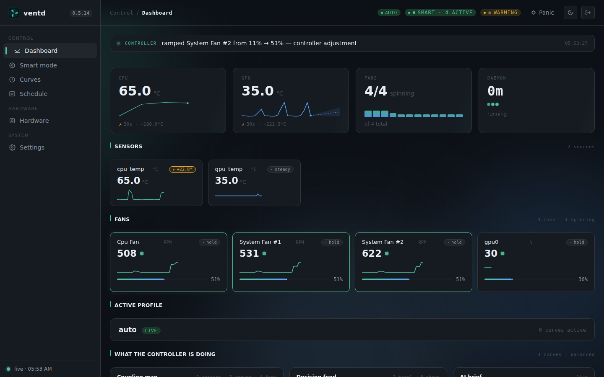

# ventd

[](https://github.com/ventd/ventd/actions/workflows/ci.yml)
[](https://github.com/ventd/ventd/releases)
[](go.mod)
[](LICENSE)
[](#supported-platforms)

**Automatic Linux fan control. Install, open the browser, click Apply — ventd handles the rest.**

One static binary, one install command, one URL. Hardware detection, calibration, curve editing, and recovery all happen in the web UI. The terminal install command is the last terminal command you need to run.

<p align="center">
  
</p>

<p align="center">
  <em>Dashboard: live fan PWM and RPM streamed from the daemon, per-fan curves editable in place.</em>
</p>

<p align="center">
  
</p>

<p align="center">
  <em>First boot: ventd serves a setup page on <code>https://&lt;host&gt;:9999</code> the moment the daemon starts. Enter the one-time token, set a password, done.</em>
</p>

## Features

- **Automatic hardware detection.** Enumerates every writable fan control the kernel exposes via `hwmon` (motherboard Super I/O chips — Nuvoton, ITE, AMD K10Temp, Intel coretemp, and the rest) plus NVIDIA GPUs through runtime-loaded NVML. Reads AMD GPU temperatures through the amdgpu hwmon layer. Intel Arc reads as monitor-only.
- **Automatic calibration.** Measures start PWM, stop PWM, max RPM, and the full PWM→RPM curve per fan. Runs server-side; survives browser disconnect and daemon restart. Abortable from the UI.
- **Automatic safety.** Restores `pwm_enable` to its pre-daemon state on every software exit path — `SIGTERM`, `SIGINT`, panic, `SIGKILL`, OOM kill, watchdog timeout — within two seconds. See [docs/safety.md](docs/safety.md) for the full model.
- **Automatic hardware change detection.** Plug a new fan or GPU in; ventd notices within a second via `AF_NETLINK` uevents (capped at a 10-second rescan when unavailable) and offers to add it.
- **Zero terminal after install.** Hardware scan, dependency install, calibration, curve editing, and service control all happen in the web UI.
- **Single static binary.** `CGO_ENABLED=0`. NVML loaded at runtime via `dlopen`; GPU features disable silently if the library is absent. No Python, Node, or runtime dependencies beyond libc.

## What's coming

Ventd is under active development. The [roadmap](docs/roadmap.md) covers the full plan; near-term highlights:

- **More fan hardware** — IPMI (server BMCs), USB AIO pumps (Corsair, NZXT, Lian Li), laptop embedded controllers (Framework, ThinkPad, Dell), ARM SBC PWM (Raspberry Pi), Apple Silicon via Asahi.
- **Learning control** — PI controller with autotune; optional MPC (model-predictive control) that learns your machine's thermal behaviour and runs fans quieter than any curve can.
- **Cross-platform** — Windows, macOS (Intel + Apple Silicon), FreeBSD, OpenBSD, illumos, Android.
- **Acoustic health** — detect bearing wear from fan sound; dither synchronised fans to break beat frequencies.
- **Curated profile database** — first-boot zero-click on hardware ventd has seen before.

Phase 1 (HAL foundation, hot-loop optimisation, fingerprint-keyed hardware database) is complete as of April 2026. Phase 2 (the multi-backend portfolio above) is underway.

## Install

```
curl -sSL https://raw.githubusercontent.com/ventd/ventd/main/scripts/install.sh | sudo bash
```

The script detects your architecture and init system (systemd, OpenRC, or runit), downloads the binary, **verifies its SHA-256 against the published `checksums.txt` for the release**, drops it at `/usr/local/bin/ventd`, installs the service file, enables it, and starts the daemon. It prints one thing: the URL to open in your browser.

Prefer to inspect before running? Download, read, verify, then execute:

```
curl -sSL https://raw.githubusercontent.com/ventd/ventd/main/scripts/install.sh -o install.sh
less install.sh                       # read it
sudo bash install.sh
```

Open the printed URL. The setup wizard prompts for a one-time token on first run. The daemon does **not** log the token to journald; it writes it to `/run/ventd/setup-token` (0600, root-only) and, if a controlling TTY is attached, to that TTY. Recover it with:

```
sudo cat /run/ventd/setup-token
```

## Supported platforms

- **Distributions:** Ubuntu, Debian, Fedora, RHEL, CentOS, Arch, Manjaro, openSUSE, Alpine, Void, NixOS
- **Init systems:** systemd, OpenRC, runit
- **Architectures:** amd64, arm64
- **C library:** glibc and musl
- **GPU:** NVIDIA (via NVML — temperature reading works out of the box; GPU fan *writes* require a one-time udev rule, see [NVIDIA GPU fan control](docs/nvidia-fan-control.md)); AMD (via amdgpu hwmon). Intel Arc is read-only at the kernel level; monitoring only.

## How it compares

| | ventd | CoolerControl | fan2go | thinkfan | lm-sensors fancontrol |
|---|---|---|---|---|---|
| Zero-config first boot | yes | no | no | no | no |
| Browser-only setup (no terminal after install) | yes | no | no | no | no |
| Automatic calibration | yes | manual | manual | manual | manual |
| Single static binary | yes | no | yes | yes | script |
| Runtime NVML `dlopen` (no nvidia build flag) | yes | no | no | no | no |
| Hardware change detection | yes | no | no | no | no |
| Curated per-hardware profiles | no | yes | no | partial | no |
| Native desktop GUI | no (web UI) | yes (Qt) | no | no | no |

CoolerControl is the more mature option if you want a pre-seeded profile for your specific AIO and a native desktop app. `ventd` trades those for zero-config first boot, a browser-only workflow that works over the network, and no runtime dependencies.

## Documentation

- [Roadmap](docs/roadmap.md)
- [Installation guide](docs/install.md)
- [Configuration reference](docs/config.md)
- [Hardware compatibility](docs/hardware.md)
- [NVIDIA GPU fan control](docs/nvidia-fan-control.md)
- [Safety model](docs/safety.md)
- [Troubleshooting](docs/troubleshooting.md)

## Safety

`ventd` controls physical hardware. Every software exit path — graceful or ungraceful — restores `pwm_enable=1` and hands control back to BIOS firmware within two seconds. Calibration sweeps that drive PWM to `0` are backed by a per-fan sentinel that escalates to a quiet floor if the zero state persists. Full model and failure-class breakdown in [docs/safety.md](docs/safety.md).

Report any case where `ventd` leaves a fan in an unsafe state as a [SECURITY.md](SECURITY.md) issue, not a regular bug.

## Building from source

```
git clone https://github.com/ventd/ventd
cd ventd
go build ./cmd/ventd/
```

Requires Go 1.25 or later. No other build dependencies.

## License

GPL-3.0. See [LICENSE](LICENSE).

## Contributing

See [CONTRIBUTING.md](CONTRIBUTING.md). Pull requests, issues, and hardware compatibility reports welcome.
